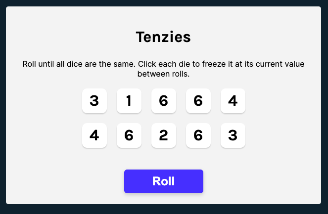
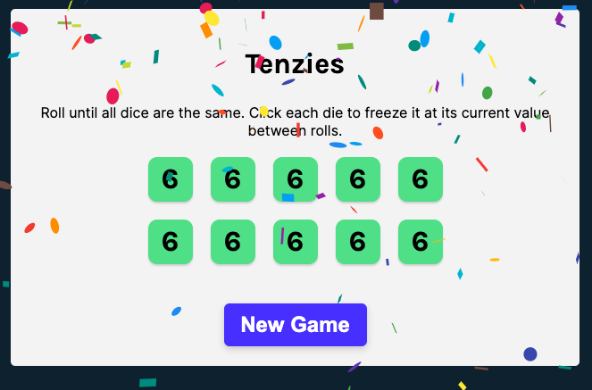

## Table of contents

- [Overview](#overview)
  - [Screenshot](#screenshot)
  - [Links](#links)
- [My process](#my-process)
  - [Built with](#built-with)
  - [What I learned](#what-i-learned)
  - [Continued development](#continued-development)
- [Author](#author)
- [Acknowledgments](#acknowledgments)

## Overview

### Screenshot

### Links

- Live Site URL: [Deployed with netlify](https://animated-taffy-960ebc.netlify.app/)

## My process

### Built with

- Semantic HTML5 markup
- CSS custom properties
- Flexbox
- CSS Grid
- Mobile-first workflow
- [React](https://reactjs.org/) - JS library
- [Nano id](https://www.npmjs.com/package/nanoid) - A tiny, secure, URL-friendly, unique string ID generator for JavaScript.
- [React confetti](https://www.npmjs.com/package/react-confetti) - Confetti without the cleanup.

### What I learned

This was a really great refresher for react hooks and basic JS algorithms after working in front end for so long.

### Continued development

I'd like to add some additional features eventually like tracking the number of rolls it takes a player to win the game, track time it took to win, save best time to local storage, put real dots on the dice and maybe even eventually be able to race other players.

## Author

- LinkedIn - [Layne Taylor](https://www.linkedin.com/in/layne-taylor/)
- Twitter - [@laynerzzzz](https://www.frontendmentor.io/profile/laynerzzzz)

## Acknowledgments

This was a project done in Scrimba's react course taught by Bob Ziroll.
